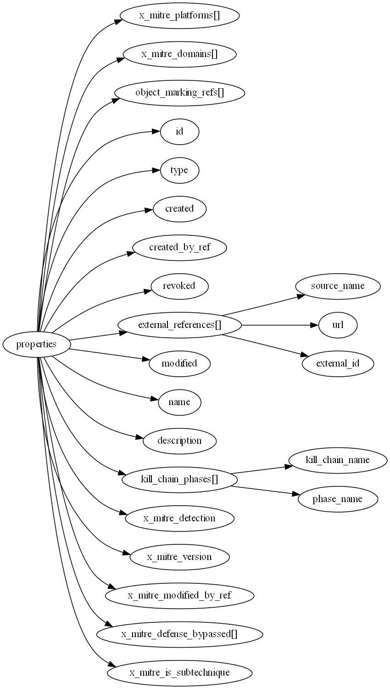

# JSON (tool)kit

> Yet another toolkit for working with JSON

## Features:

- Convert one or more JSON documents into a [JSON Schema](https://json-schema.org/learn/getting-started-step-by-step.html)
- Convert a JSON Schema into a [directed acyclic graph (DAG)](https://en.wikipedia.org/wiki/Directed_acyclic_graph) using [NetworkX](https://networkx.github.io/)
  - Serialize DAGs to [DOT format](<https://en.wikipedia.org/wiki/DOT_(graph_description_language)>)
  - Visualize DAGs using [Matplotlib](https://www.graphviz.org/)

## Requirements

- [Python](https://www.python.org/) 3.10+ (see [pyproject.toml](pyproject.toml)
- [Poetry](https://python-poetry.org/)

## Installation

To install this project and its dependencies, run:

```bash
make install
```

> **Note:** This project uses [Poetry](https://python-poetry.org/) for dependency management.

## Development

To update the `requirements.txt` file, run:

```bash
make requirements
```

To regenerate example data:

```bash
make example-data
```

## Usage

### JSON to JSON Schema

The `json2jsonschema` command can be used to generate a JSON Schema from one or more JSON documents.

```bash
poetry run json2jsonschema --help
Usage: json2jsonschema.cmd [OPTIONS] INPUT_FILES...

  Create a JSON Schema from one or more JSON files.

Options:
  -o, --output-file TEXT  Path to output file
  --indent INTEGER        Indentation level
  --help                  Show this message and exit.
```

For example:

```bash
poetry run json2jsonschema .\resources\example-data\json\stix2\mitre-attack\json\attack-pattern--00d0b012-8a03-410e-95de-5826bf542de6.json
```

```json
{
  "$schema": "http://json-schema.org/schema#",
  "type": "object",
  "properties": {
    "type": {
      "type": "string"
    },
    "id": {
      "type": "string"
    },
    "spec_version": {
      "type": "string"
    },
    "objects": {
      "type": "array",
      "items": {
        "type": "object",
        "properties": {
          "x_mitre_platforms": {
            "type": "array",
            "items": {
              "type": "string"
            }
          },
          "x_mitre_domains": {
            "type": "array",
            "items": {
              "type": "string"
            }
          },
          "object_marking_refs": {
            "type": "array",
            "items": {
              "type": "string"
            }
          },
          "id": {
            "type": "string"
          },
          "type": {
            "type": "string"
          },
          "created": {
            "type": "string"
          },
          "created_by_ref": {
            "type": "string"
          },
          "revoked": {
            "type": "boolean"
          },
          "external_references": {
            "type": "array",
            "items": {
              "type": "object",
              "properties": {
                "source_name": {
                  "type": "string"
                },
                "url": {
                  "type": "string"
                },
                "external_id": {
                  "type": "string"
                }
              },
              "required": ["external_id", "source_name", "url"]
            }
          },
          "modified": {
            "type": "string"
          },
          "name": {
            "type": "string"
          },
          "description": {
            "type": "string"
          },
          "kill_chain_phases": {
            "type": "array",
            "items": {
              "type": "object",
              "properties": {
                "kill_chain_name": {
                  "type": "string"
                },
                "phase_name": {
                  "type": "string"
                }
              },
              "required": ["kill_chain_name", "phase_name"]
            }
          },
          "x_mitre_detection": {
            "type": "string"
          },
          "x_mitre_version": {
            "type": "string"
          },
          "x_mitre_modified_by_ref": {
            "type": "string"
          },
          "x_mitre_defense_bypassed": {
            "type": "array",
            "items": {
              "type": "string"
            }
          },
          "x_mitre_is_subtechnique": {
            "type": "boolean"
          }
        },
        "required": [
          "created",
          "created_by_ref",
          "description",
          "external_references",
          "id",
          "kill_chain_phases",
          "modified",
          "name",
          "object_marking_refs",
          "revoked",
          "type",
          "x_mitre_defense_bypassed",
          "x_mitre_detection",
          "x_mitre_domains",
          "x_mitre_is_subtechnique",
          "x_mitre_modified_by_ref",
          "x_mitre_platforms",
          "x_mitre_version"
        ]
      }
    }
  },
  "required": ["id", "objects", "spec_version", "type"]
}
```

### JSON Schema to DAG in DOT format

The `jsonschema2dot` command can be used to generate a DOT file from a JSON Schema.

```bash
poetry run jsonschema2dot --help                                                              Usage: jsonschema2dot.cmd [OPTIONS] INPUT_FILES...

  Convert a JSON Schema into a DOT file.

Options:
  -o, --output-file TEXT  Path to output file
  --indent INTEGER        Indentation level
  --help                  Show this message and exit
```

For example:

```
poetry run jsonschema2dot .\resources\example-data\json\stix2\mitre-attack\json-schema\attack-pattern.json -o .\resources\example-data\json\stix2\mitre-attack\dot\attack-pattern.dot
```



```dot
digraph {
    "id" [label="id"]
    "objects" [label="objects[]"]
    "objects.created" [label="created"]
    "objects.created_by_ref" [label="created_by_ref"]
    "objects.description" [label="description"]
    "objects.external_references" [label="external_references[]"]
    "objects.external_references.external_id" [label="external_id"]
    "objects.external_references.source_name" [label="source_name"]
    "objects.external_references.url" [label="url"]
    "objects.id" [label="id"]
    "objects.kill_chain_phases" [label="kill_chain_phases[]"]
    "objects.kill_chain_phases.kill_chain_name" [label="kill_chain_name"]
    "objects.kill_chain_phases.phase_name" [label="phase_name"]
    "objects.modified" [label="modified"]
    "objects.name" [label="name"]
    "objects.object_marking_refs" [label="object_marking_refs[]"]
    "objects.revoked" [label="revoked"]
    "objects.type" [label="type"]
    "objects.x_mitre_defense_bypassed" [label="x_mitre_defense_bypassed[]"]
    "objects.x_mitre_detection" [label="x_mitre_detection"]
    "objects.x_mitre_domains" [label="x_mitre_domains[]"]
    "objects.x_mitre_is_subtechnique" [label="x_mitre_is_subtechnique"]
    "objects.x_mitre_modified_by_ref" [label="x_mitre_modified_by_ref"]
    "objects.x_mitre_platforms" [label="x_mitre_platforms[]"]
    "objects.x_mitre_version" [label="x_mitre_version"]
    "spec_version" [label="spec_version"]
    "type" [label="type"]
    "properties" -> "type"
    "properties" -> "id"
    "properties" -> "spec_version"
    "properties" -> "objects"
    "objects" -> "objects.x_mitre_platforms"
    "objects" -> "objects.x_mitre_domains"
    "objects" -> "objects.object_marking_refs"
    "objects" -> "objects.id"
    "objects" -> "objects.type"
    "objects" -> "objects.created"
    "objects" -> "objects.created_by_ref"
    "objects" -> "objects.revoked"
    "objects" -> "objects.external_references"
    "objects" -> "objects.modified"
    "objects" -> "objects.name"
    "objects" -> "objects.description"
    "objects" -> "objects.kill_chain_phases"
    "objects" -> "objects.x_mitre_detection"
    "objects" -> "objects.x_mitre_version"
    "objects" -> "objects.x_mitre_modified_by_ref"
    "objects" -> "objects.x_mitre_defense_bypassed"
    "objects" -> "objects.x_mitre_is_subtechnique"
    "objects.external_references" -> "objects.external_references.source_name"
    "objects.external_references" -> "objects.external_references.url"
    "objects.external_references" -> "objects.external_references.external_id"
    "objects.kill_chain_phases" -> "objects.kill_chain_phases.kill_chain_name"
    "objects.kill_chain_phases" -> "objects.kill_chain_phases.phase_name"
}
```

This DOT file can be converted into an image using `dot`:

```shell
dot -Tpng ./resources/example-data/json/stix2/mitre-attack/dot/attack-pattern.dot -o resources/example-data/json/stix2/mitre-attack/png/attack-pattern.png
```


