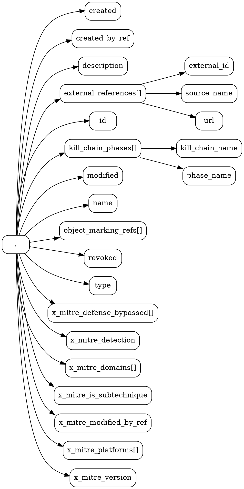

# json-kit

A Python3 module for translating JSON and JSONL documents into JSON Schemas, DOT files, and images using [Graphviz](https://graphviz.org/).

> 👷 🚧: this project is experimental, doesn't have a stable API, and is under active development.

## Features

- Convert JSON and JSONL files into JSON Schemas
- Convert JSON Schemas into DOT files
- Render DOT files as images<sub>1</sub>


> 1. Rendering is performed using the `dot` command from [Graphviz](https://graphviz.org/) and must be [installed](https://graphviz.org/download/) separately.

## Requirements

- [Python](https://www.python.org/) 3.10+ (see [pyproject.toml](pyproject.toml))
- [Poetry](https://python-poetry.org/)

## Installation

To install this project and its dependencies, run:

```bash
make install
```

## Building

This project can be compiled into an executable or wheel using the [Makefile].

### Executables

To compile an executable:

```bash
make bin
```

You need to build the executable on the same platform and architecture that you tend to run it on, as the build toolchain is not cross-platform compatible.

### Wheels

```bash
make wheel
```

## Usage

The following examples use STIX 2 representations of objects from the [MITRE ATT&CK](https://attack.mitre.org/matrices/enterprise/) and [MITRE CAPEC](https://capec.mitre.org/) frameworks which can be found in the [`examples`](examples/) directory.

### List JSON keys

To list the keys in a JSON document:

```bash
poetry run json-kit json-keys examples/stix2/mitre-attack/json/attack-pattern--00d0b012-8a03-410e-95de-5826bf542de6.json
```

```text
created
created_by_ref
description
external_references[]
external_references[].external_id
external_references[].source_name
external_references[].url
id
kill_chain_phases[]
kill_chain_phases[].kill_chain_name
kill_chain_phases[].phase_name
modified
name
object_marking_refs[]
revoked
type
x_mitre_defense_bypassed[]
x_mitre_detection
x_mitre_domains[]
x_mitre_is_subtechnique
x_mitre_modified_by_ref
x_mitre_platforms[]
x_mitre_version
```

### JSON to JSON Schema

To generate a JSON Schema from a JSON document:

```bash
poetry run json-kit json-to-json-schema examples/stix2/mitre-attack/attack-pattern--00d0b012-8a03-410e-95de-5826bf542de6.json
```

```json
{
    "$schema": "http://json-schema.org/schema#",
    "type": "object",
    "properties": {
        "x_mitre_platforms": {
            "type": "array",
            "items": {
                "type": "string"
            }
        },
        "x_mitre_domains": {
            "type": "array",
            "items": {
                "type": "string"
            }
        },
        "object_marking_refs": {
            "type": "array",
            "items": {
                "type": "string"
            }
        },
        "id": {
            "type": "string"
        },
        "type": {
            "type": "string"
        },
        "created": {
            "type": "string"
        },
        "created_by_ref": {
            "type": "string"
        },
        "revoked": {
            "type": "boolean"
        },
        "external_references": {
            "type": "array",
            "items": {
                "type": "object",
                "properties": {
                    "source_name": {
                        "type": "string"
                    },
                    "url": {
                        "type": "string"
                    },
                    "external_id": {
                        "type": "string"
                    }
                },
                "required": [
                    "external_id",
                    "source_name",
                    "url"
                ]
            }
        },
        "modified": {
            "type": "string"
        },
        "name": {
            "type": "string"
        },
        "description": {
            "type": "string"
        },
        "kill_chain_phases": {
            "type": "array",
            "items": {
                "type": "object",
                "properties": {
                    "kill_chain_name": {
                        "type": "string"
                    },
                    "phase_name": {
                        "type": "string"
                    }
                },
                "required": [
                    "kill_chain_name",
                    "phase_name"
                ]
            }
        },
        "x_mitre_detection": {
            "type": "string"
        },
        "x_mitre_version": {
            "type": "string"
        },
        "x_mitre_modified_by_ref": {
            "type": "string"
        },
        "x_mitre_defense_bypassed": {
            "type": "array",
            "items": {
                "type": "string"
            }
        },
        "x_mitre_is_subtechnique": {
            "type": "boolean"
        }
    },
    "required": [
        "created",
        "created_by_ref",
        "description",
        "external_references",
        "id",
        "kill_chain_phases",
        "modified",
        "name",
        "object_marking_refs",
        "revoked",
        "type",
        "x_mitre_defense_bypassed",
        "x_mitre_detection",
        "x_mitre_domains",
        "x_mitre_is_subtechnique",
        "x_mitre_modified_by_ref",
        "x_mitre_platforms",
        "x_mitre_version"
    ]
}
```

To generate a JSON Schema from a directory of JSON documents, simply pass in:

1. The path to the directory;
2. The path to every file that you're interested in; or
3. A glob pattern that matches the files that you're interested in (e.g. `*.json`)

```bash
poetry run json-kit json-to-json-schema examples/stix2/mitre-attack/*.json
```

The resulting JSON Schema will be the union of all unique JSON formats observed across all of the provided files<sub>1</sub>.

> 1. Translating a sparse set of JSON documents with different formats into a single unifying JSON Schema is a great way to determine which fields are required, and which fields are optional.

### JSON to DOT

To generate a DOT file from a JSON document:

```bash
poetry run json-kit json-to-dot examples/stix2/mitre-attack/attack-pattern--00d0b012-8a03-410e-95de-5826bf542de6.json
```



### DOT to PNG

To generate a PNG image from a DOT file:

```bash
poetry run json-kit dot-to-png examples/stix2/mitre-attack/attack-pattern--00d0b012-8a03-410e-95de-5826bf542de6.dot
```

### Kitchen sink

To generate a JSON Schema, DOT, SVG, and PNG files from a JSON document:

```bash
json_file=examples/stix2/mitre-attack/attack-pattern--00d0b012-8a03-410e-95de-5826bf542de6.json
json_schema_file=${json_file%.*}.schema.json
dot_file=${json_file%.*}.dot
png_file=${json_file%.*}.png
svg_file=${json_file%.*}.svg

poetry run json-kit json-to-json-schema $json_file > $json_schema_file
poetry run json-kit json-to-dot $json_file > $dot_file
poetry run json-kit json-to-png $json_file > $dot_file
poetry run json-kit json-to-svg $json_file > $dot_file

poetry run json-kit json-schema-to-dot $json_schema_file > $dot_file
poetry run json-kit json-schema-to-png $json_schema_file $png_file
poetry run json-kit json-schema-to-svg $json_schema_file $svg_file

poetry run json-kit dot-to-image $dot_file
poetry run json-kit dot-to-image $dot_file $png_file
poetry run json-kit dot-to-image $dot_file $svg_file

poetry run json-kit dot-to-png $dot_file
poetry run json-kit dot-to-svg $dot_file
```
