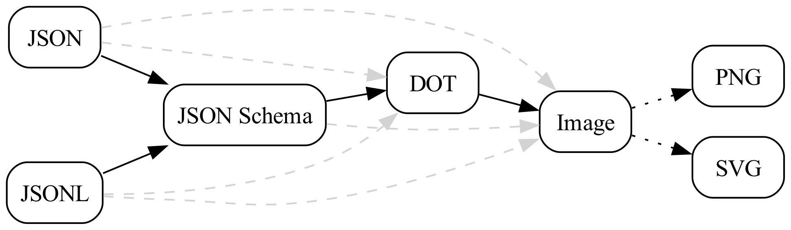

# json-kit

A Python3 module for translating JSON and JSONL documents into JSON Schemas, DOT files, and images using [Graphviz](https://graphviz.org/).

> 👷 🚧: this project is experimental, doesn't have a stable API, and is under active development.

## Features

- Convert JSON and JSONL files into JSON Schemas
- Convert JSON Schemas into DOT files
- Render DOT files as images<sub>1</sub>



> 1. Rendering is performed using the `dot` command from [Graphviz](https://graphviz.org/) and must be [installed](https://graphviz.org/download/) separately.

## Requirements

- [Python](https://www.python.org/) 3.10+ (see [pyproject.toml](pyproject.toml))
- [Poetry](https://python-poetry.org/)

## Installation

To install this project and its dependencies, run:

```bash
make install
```

## Building

This project can be compiled into an executable or wheel using the [Makefile].

### Executables

To compile an executable:

```bash
make bin
```

You need to build the executable on the same platform and architecture that you tend to run it on, as the build toolchain is not cross-platform compatible.

### Wheels

```bash
make wheel
```

## Usage

The following examples use STIX 2 representations of objects from the [MITRE ATT&CK](https://attack.mitre.org/matrices/enterprise/) and [MITRE CAPEC](https://capec.mitre.org/) frameworks which can be found in the [`examples`](examples/) directory.

### List JSON keys

To list the keys in a JSON document:

```bash

```

```text

```

### JSON to JSON Schema

To generate a JSON Schema from a JSON document:

```bash

```

To generate a JSON Schema from a JSONL document:

```bash

```

To generate a JSON Schema from a directory of JSON documents:

```bash

```

### JSON to DOT

To generate a DOT file from a JSON document:

```bash

```

To generate a DOT file from a JSON Schema:

```bash

```

To generate a DOT file from a directory of JSON documents:

```bash

```

To generate a DOT file from a directory of JSON Schemas:

```bash

```

### JSON to PNG

To generate a PNG image from a JSON document:

```bash

```

To generate a PNG image from a JSON Schema:

```bash

```

To generate a PNG image from a directory of JSON documents:

```bash

```

### JSON to SVG

To generate a SVG image from a JSON document:

```bash

```

To generate an SVG image from a JSON Schema:

```bash

```
