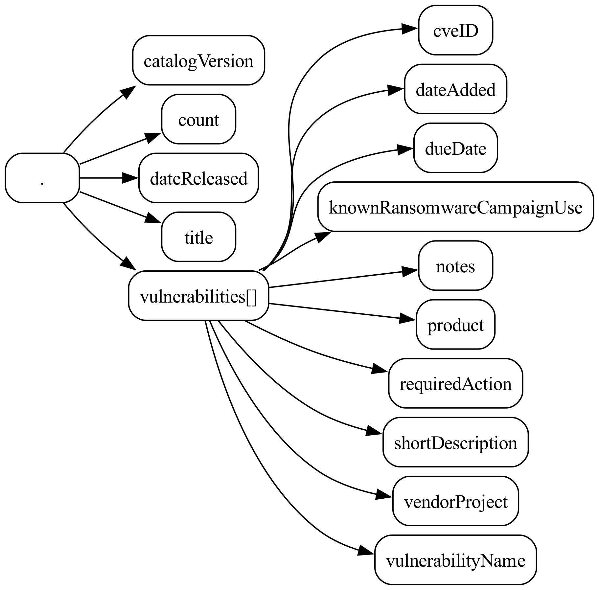
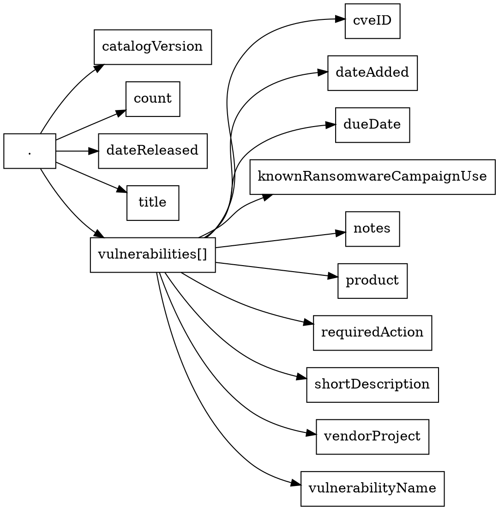

# json-kit

`json-kit` is a Python 3 package for working with JSON files.

> **Note**: This project is in the early stages of development and is subject to change at any time.

## Features

One of the main features of `json-kit` is the ability to visualize the structure of JSON files as directed graphs with [NetworkX](https://networkx.org/) and [GraphViz](https://graphviz.org/).

This is useful when writing parsers, or when simply trying to better understand the structure of a given JSON file.

For example, we can visualize the [structure](https://www.cisa.gov/sites/default/files/feeds/known_exploited_vulnerabilities_schema.json) of the [CISA Known Exploited Vulnerabilities (KEV) Catalog](https://www.cisa.gov/sites/default/files/feeds/known_exploited_vulnerabilities.json) as follows:



## Usage

- [json-kit](#json-kit)
  - [Features](#features)
  - [Usage](#usage)
    - [Command line](#command-line)
      - [List keys in a JSON file](#list-keys-in-a-json-file)
      - [Generate a JSON Schema from a JSON file](#generate-a-json-schema-from-a-json-file)
      - [Visualize JSON files as directed graphs with GraphViz](#visualize-json-files-as-directed-graphs-with-graphviz)

### Command line

#### List keys in a JSON file

To list the keys in a particular JSON file:

```bash
poetry run json-kit keys examples/cisa-kev/known_exploited_vulnerabilities.json
```

```json
[
    "catalogVersion",
    "count",
    "dateReleased",
    "title",
    "vulnerabilities[]",
    "vulnerabilities[].cveID",
    "vulnerabilities[].dateAdded",
    "vulnerabilities[].dueDate",
    "vulnerabilities[].knownRansomwareCampaignUse",
    "vulnerabilities[].notes",
    "vulnerabilities[].product",
    "vulnerabilities[].requiredAction",
    "vulnerabilities[].shortDescription",
    "vulnerabilities[].vendorProject",
    "vulnerabilities[].vulnerabilityName"
]
```

#### Generate a JSON Schema from a JSON file

To generate a [JSON Schema](examples/cisa-kev/known_exploited_vulnerabilities_schema.json) from a [JSON file](examples/cisa-kev/known_exploited_vulnerabilities.json):

```bash
poetry run json-kit json-schema examples/cisa-kev/known_exploited_vulnerabilities.json
```

```json
{
    "type": "object",
    "properties": {
        "title": {
            "type": "string"
        },
        "catalogVersion": {
            "type": "string"
        },
        "dateReleased": {
            "type": "string"
        },
        "count": {
            "type": "integer"
        },
        "vulnerabilities": {
            "type": "array",
            "items": {
                "type": "object",
                "properties": {
                    "cveID": {
                        "type": "string"
                    },
                    "vendorProject": {
                        "type": "string"
                    },
                    "product": {
                        "type": "string"
                    },
                    "vulnerabilityName": {
                        "type": "string"
                    },
                    "dateAdded": {
                        "type": "string"
                    },
                    "shortDescription": {
                        "type": "string"
                    },
                    "requiredAction": {
                        "type": "string"
                    },
                    "dueDate": {
                        "type": "string"
                    },
                    "knownRansomwareCampaignUse": {
                        "type": "string"
                    },
                    "notes": {
                        "type": "string"
                    }
                },
                "required": [
                    "cveID",
                    "dateAdded",
                    "dueDate",
                    "knownRansomwareCampaignUse",
                    "notes",
                    "product",
                    "requiredAction",
                    "shortDescription",
                    "vendorProject",
                    "vulnerabilityName"
                ]
            }
        }
    },
    "required": [
        "catalogVersion",
        "count",
        "dateReleased",
        "title",
        "vulnerabilities"
    ]
}
```

#### Visualize JSON files as directed graphs with GraphViz

To convert a JSON file to [DOT format](examples/cisa-kev/known_exploited_vulnerabilities.dot):

```bash
poetry run json-kit draw-keys examples/cisa-kev/known_exploited_vulnerabilities.json
```



To convert a JSON file to an [image in PNG format](examples/cisa-kev/known_exploited_vulnerabilities.png):

```bash
poetry run json-kit draw examples/cisa-kev/known_exploited_vulnerabilities.json -o examples/cisa-kev/known_exploited_vulnerabilities.png
```


To convert a JSON file to an [image in SVG format](examples/cisa-kev/known_exploited_vulnerabilities.svg):

```bash
poetry run json-kit draw examples/cisa-kev/known_exploited_vulnerabilities.json -o examples/cisa-kev/known_exploited_vulnerabilities.svg
```
