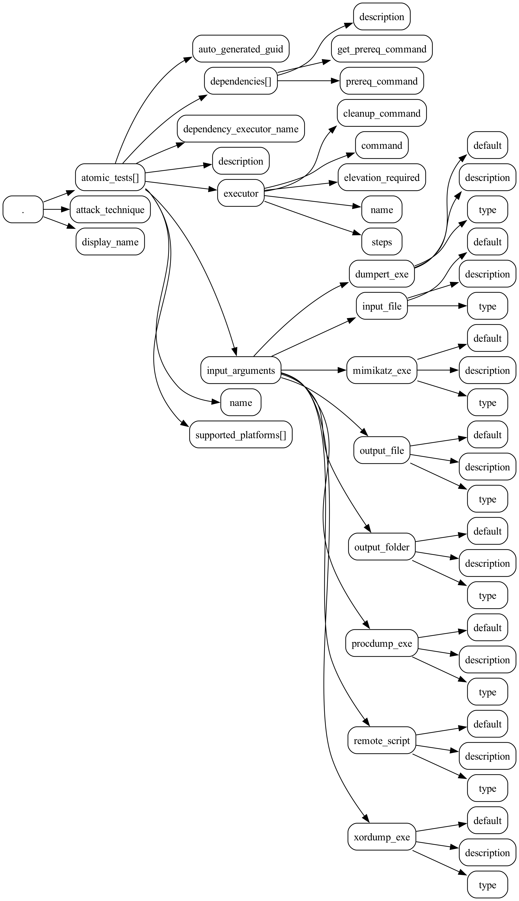

# json-kit

## Features

- [List the keys in one or more JSON files](#list-keys-in-a-json-file)
- [Generate a JSON Schema from one or more JSON files](#generate-a-json-schema-from-a-json-file)
- [Render JSON documents as directed graphs with NetworkX and GraphViz](#visualize-json-files-as-directed-graphs-with-graphviz)

## Usage

### Command line

#### List keys in a JSON file

To list the keys in a particular JSON file:

```bash
poetry run json-kit keys ~/src/atomic-red-team/atomics/T1003.001/T1003.001.json
```

```
atomic_tests[]
atomic_tests[].auto_generated_guid
atomic_tests[].dependencies[]
atomic_tests[].dependencies[].description
atomic_tests[].dependencies[].get_prereq_command
...
atomic_tests[].input_arguments.xordump_exe.type
atomic_tests[].name
atomic_tests[].supported_platforms[]
attack_technique
display_name
```

#### Generate a JSON Schema from a JSON file

To generate a [JSON Schema](examples/atomic-red-team/T1003.001.json_schema.json) from a [JSON file](examples/atomic-red-team/T1003.001.json):

```bash
poetry run json-kit json-schema ~/src/atomic-red-team/atomics/T1003.001/T1003.001.json
```

```json
{
    "$schema": "http://json-schema.org/schema#",
    "type": "object",
    "properties": {
        "attack_technique": {
            "type": "string"
        },
        "display_name": {
            "type": "string"
        },
        "atomic_tests": {
            "type": "array",
            "items": {
                "type": "object",
                "properties": {
                    "name": {
                        "type": "string"
                    },
                    "auto_generated_guid": {
                        "type": "string"
                    },
                    "description": {
                        "type": "string"
                    },
                    "supported_platforms": {
                        "type": "array",
                        "items": {
                            "type": "string"
                        }
                    },
                    "input_arguments": {
                        "type": "object",
                        "properties": {
                            "output_file": {
                                "type": "object",
                                "properties": {
                                    "description": {
                                        "type": "string"
                                    },
                                    "type": {
                                        "type": "string"
                                    },
                                    "default": {
                                        "type": "string"
                                    }
                                },
                                "required": [
                                    "default",
                                    "description",
                                    "type"
                                ]
                            },
                            "procdump_exe": {
                                "type": "object",
                                "properties": {
                                    "description": {
                                        "type": "string"
                                    },
                                    "type": {
                                        "type": "string"
                                    },
                                    "default": {
                                        "type": "string"
                                    }
                                },
                                "required": [
                                    "default",
                                    "description",
                                    "type"
                                ]
                            },
                            "dumpert_exe": {
                                "type": "object",
                                "properties": {
                                    "description": {
                                        "type": "string"
                                    },
                                    "type": {
                                        "type": "string"
                                    },
                                    "default": {
                                        "type": "string"
                                    }
                                },
                                "required": [
                                    "default",
                                    "description",
                                    "type"
                                ]
                            },
                            "input_file": {
                                "type": "object",
                                "properties": {
                                    "description": {
                                        "type": "string"
                                    },
                                    "type": {
                                        "type": "string"
                                    },
                                    "default": {
                                        "type": "string"
                                    }
                                },
                                "required": [
                                    "default",
                                    "description",
                                    "type"
                                ]
                            },
                            "mimikatz_exe": {
                                "type": "object",
                                "properties": {
                                    "description": {
                                        "type": "string"
                                    },
                                    "type": {
                                        "type": "string"
                                    },
                                    "default": {
                                        "type": "string"
                                    }
                                },
                                "required": [
                                    "default",
                                    "description",
                                    "type"
                                ]
                            },
                            "remote_script": {
                                "type": "object",
                                "properties": {
                                    "description": {
                                        "type": "string"
                                    },
                                    "type": {
                                        "type": "string"
                                    },
                                    "default": {
                                        "type": "string"
                                    }
                                },
                                "required": [
                                    "default",
                                    "description",
                                    "type"
                                ]
                            },
                            "xordump_exe": {
                                "type": "object",
                                "properties": {
                                    "description": {
                                        "type": "string"
                                    },
                                    "type": {
                                        "type": "string"
                                    },
                                    "default": {
                                        "type": "string"
                                    }
                                },
                                "required": [
                                    "default",
                                    "description",
                                    "type"
                                ]
                            },
                            "output_folder": {
                                "type": "object",
                                "properties": {
                                    "description": {
                                        "type": "string"
                                    },
                                    "type": {
                                        "type": "string"
                                    },
                                    "default": {
                                        "type": "string"
                                    }
                                },
                                "required": [
                                    "default",
                                    "description",
                                    "type"
                                ]
                            }
                        }
                    },
                    "dependency_executor_name": {
                        "type": "string"
                    },
                    "dependencies": {
                        "type": "array",
                        "items": {
                            "type": "object",
                            "properties": {
                                "description": {
                                    "type": "string"
                                },
                                "prereq_command": {
                                    "type": "string"
                                },
                                "get_prereq_command": {
                                    "type": "string"
                                }
                            },
                            "required": [
                                "description",
                                "get_prereq_command",
                                "prereq_command"
                            ]
                        }
                    },
                    "executor": {
                        "type": "object",
                        "properties": {
                            "command": {
                                "type": "string"
                            },
                            "cleanup_command": {
                                "type": "string"
                            },
                            "name": {
                                "type": "string"
                            },
                            "elevation_required": {
                                "type": "boolean"
                            },
                            "steps": {
                                "type": "string"
                            }
                        },
                        "required": [
                            "name"
                        ]
                    }
                },
                "required": [
                    "auto_generated_guid",
                    "description",
                    "executor",
                    "name",
                    "supported_platforms"
                ]
            }
        }
    },
    "required": [
        "atomic_tests",
        "attack_technique",
        "display_name"
    ]
}
```

#### Visualize JSON files as directed graphs with GraphViz

To convert a JSON file to DOT format:

```bash
poetry run json-kit draw examples/atomic-red-team/T1003.001.json -o examples/atomic-red-team/T1003.001.dot
```

To convert a JSON file to an image in PNG format:

```bash
poetry run json-kit draw examples/atomic-red-team/T1003.001.json -o examples/atomic-red-team/T1003.001.png
```



To convert a JSON file to an [image in SVG format](examples/atomic-red-team/T1003.001.svg):

```bash
poetry run json-kit draw examples/atomic-red-team/T1003.001.json -o examples/atomic-red-team/T1003.001.svg
```

> Note: requires `dot` from GraphViz to be installed and available in the PATH.
